# Задание

## Описание
Cоздать BaseCharacter, BaseInAnctionCaracter, BaseFunkoPop, BaseCosplayer, BaseHuman
составить из них и из Mixin...able логику наследований
так, чтобы было минимум 6+ Mixin'ов (созданных, а не у каждого класса)
с помощью этих интерфейсов (миксинов) и наследования создать:

## Персонажи

Shrek, PussInBoots, Donkey, JackHorner

на каждого должен быть и персонаж, и фанко поп, и косплеер

итого должно быть:

BaseCharacter:
    Shrek
    PussInBoots
    Donkey
    JackHorner

BaseCharacter -> BaseInActionCharacter:
    Shrek -> ShrekInAction
    PussInBoots -> PussInBootsInAction
    Donkey -> DonkeyInAction
    JackHorner -> JackHornerInAction

BaseCharacter -> BaseFunkoPop:
    Shrek -> ShrekInAction
    PussInBoots -> PussInBootsInAction
    Donkey -> DonkeyInAction
    JackHorner -> JackHornerInAction

BaseCharacter -> BaseCosplayer <- BaseHuman:
    Shrek -> ShrekCosplayer
    PussInBoots -> PussInBootsCosplayer
    Donkey -> DonkeyCosplayer
    JackHorner -> JackHornerCosplayer

## Схема

```mermaid
classDiagram
    %% === Базовые классы ===
    class BaseCharacter {
        +name: str
    }

    class BaseInActionCharacter {
    }

    class BaseFunkoPop {
        +display()
    }

    class BaseCosplayer {
    }

    class BaseHuman {
        +is_human: bool
    }

    %% === Миксины (интерфейсы/поведения) ===
    class MixinSpeakable {
        +speak()
    }

    class MixinActionable {
        +perform_action()
    }

    class MixinCollectible {
        +is_collectible: bool
    }

    class MixinPoseable {
        +pose()
    }

    class MixinCostumeWearable {
        +costume: str
    }

    class MixinAnimated {
        +is_animated: bool
    }

    class MixinFunny {
        +make_laugh()
    }

    %% === Конкретные персонажи (обычные) ===
    class Shrek {
    }
    class PussInBoots {
    }
    class Donkey {
    }
    class JackHorner {
    }

    %% === Action-версии ===
    class ShrekInAction {
    }
    class PussInBootsInAction {
    }
    class DonkeyInAction {
    }
    class JackHornerInAction {
    }

    %% === Funko Pop-версии ===
    class ShrekFunkoPop {
    }
    class PussInBootsFunkoPop {
    }
    class DonkeyFunkoPop {
    }
    class JackHornerFunkoPop {
    }

    %% === Cosplayer-версии ===
    class ShrekCosplayer {
    }
    class PussInBootsCosplayer {
    }
    class DonkeyCosplayer {
    }
    class JackHornerCosplayer {
    }

    %% === Наследование базовых классов ===
    BaseCharacter --> Shrek
    BaseCharacter --> PussInBoots
    BaseCharacter --> Donkey
    BaseCharacter --> JackHorner

    BaseCharacter --> BaseInActionCharacter
    BaseInActionCharacter --> ShrekInAction
    BaseInActionCharacter --> PussInBootsInAction
    BaseInActionCharacter --> DonkeyInAction
    BaseInActionCharacter --> JackHornerInAction

    BaseCharacter --> BaseFunkoPop
    BaseFunkoPop --> ShrekFunkoPop
    BaseFunkoPop --> PussInBootsFunkoPop
    BaseFunkoPop --> DonkeyFunkoPop
    BaseFunkoPop --> JackHornerFunkoPop

    BaseCharacter --> BaseCosplayer
    BaseHuman --> BaseCosplayer
    BaseCosplayer --> ShrekCosplayer
    BaseCosplayer --> PussInBootsCosplayer
    BaseCosplayer --> DonkeyCosplayer
    BaseCosplayer --> JackHornerCosplayer

    %% === Применение миксинов (через реализацию) ===
    MixinSpeakable --> BaseCharacter
    MixinActionable --> BaseInActionCharacter
    MixinCollectible --> BaseFunkoPop
    MixinPoseable --> BaseCosplayer
    MixinCostumeWearable --> BaseCosplayer
    MixinAnimated --> BaseCharacter
    MixinFunny --> BaseCharacter

    %% === Уточнение: персонажи наследуют поведения через базовые классы
    %% (в Mermaid это уже учтено через иерархию выше)
```

